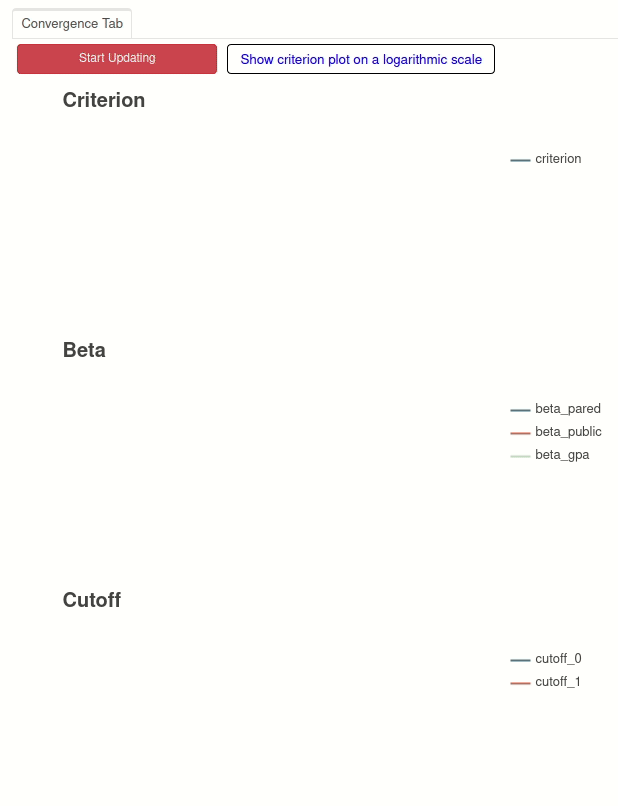

=========
estimagic
=========

.. image:: https://anaconda.org/OpenSourceEconomics/estimagic/badges/version.svg
   :target: https://anaconda.org/OpenSourceEconomics/estimagic

.. image:: https://anaconda.org/OpenSourceEconomics/estimagic/badges/platforms.svg
   :target: https://anaconda.org/OpenSourceEconomics/estimagic

.. image:: https://img.shields.io/badge/License-BSD%203--Clause-orange.svg
    :target: https://opensource.org/licenses/BSD-3-Clause
    :alt: License

.. image:: https://readthedocs.org/projects/estimagic/badge/?version=latest
    :target: https://estimagic.readthedocs.io/en/latest/?badge=latest
    :alt: Documentation Status

.. image:: https://github.com/OpenSourceEconomics/estimagic/workflows/Continuous%20Integration%20Workflow/badge.svg?branch=main
    :target: https://github.com/OpenSourceEconomics/estimagic/actions?query=branch%3Amain

.. image:: https://codecov.io/gh/OpenSourceEconomics/estimagic/branch/main/graph/badge.svg
  :target: https://codecov.io/gh/OpenSourceEconomics/estimagic

.. image:: https://img.shields.io/badge/code%20style-black-000000.svg
    :target: https://github.com/psf/black

Introduction
============

estimagic is a Python package to fit large scale empirical models to data and make
inferences about the estimated model parameters. It is especially suited to solve
difficult constrained optimization problems.

estimagic provides several advantages over similar packages, including a unified
interface that supports a large number of local and global optimization algorithms
and the possibility of monitoring the optimization procedure via a beautiful
interactive dashboard.

estimagic provides tools for nonlinear optimization, numerical differentiation
and statistical inference.

Optimization
------------

- estimagic wraps algorithms from *scipy.optimize*, *nlopt*, *pygmo* and more.
- estimagic implements constraints efficiently via reparametrization, so you can solve
  constrained problems with any optimzer that supports bounds.
- estimagic encourages name-based parameters handling. Parameters are specified
  as pandas DataFrames with any kind of single or MultiIndex.
- The complete history of parameters and function evaluations can be saved in a
  database for maximum reproducibility.
- Painless and efficient multistart optimization.
- The progress of the optimization is displayed in real time via an
  interactive dashboard.

Estimation and Inference
------------------------

- You can estimate a model using method of simulated moments (MSM), calculate standard
  errors and do sensitivity analysis with just one function call.
- Asymptotic standard errors for maximum likelihood estimation.
- estimagic also provides bootstrap confidence intervals and standard errors.
  Of course the bootstrap procedures are parallelized.

Numerical differentiation
-------------------------

- estimagic can calculate precise numerical derivatives using `Richardson extrapolations
  <https://en.wikipedia.org/wiki/Richardson_extrapolation>`_.
- Function evaluations needed for numerical derivatives can be done in parallel
  with pre-implemented or user provided batch evaluators.

Installation
============

The package can be installed via conda. To do so, type the following commands in a
terminal:

.. code-block:: bash

    $ conda config --add channels conda-forge
    $ conda install estimagic

The first line adds conda-forge to your conda channels. This is necessary for conda to
find all dependencies of estimagic. The second line installs estimagic and its
dependencies.

Installing optional dependencies
================================

Only ``scipy`` is a mandatory dependency of estimagic. Other algorithms
become available if you install more packages. We make this optional because most of the
time you will use at least one additional package, but only very rarely will you need all
of them.

For an overview of all optimizers and the packages you need to install to enable them
see :ref:`list_of_algorithms`.

To enable all algorithms at once, do the following:

``conda install nlopt``

``pip install Py-BOBYQA``

``pip install DFO-LS``

``conda install petsc4py`` (Not available on Windows)

``conda install cyipopt``

``conda install pygmo``

``pip install fides>=0.7.4 (Make sure you have at least 0.7.1)``

Documentation
=============

The documentation is hosted (`on rtd <https://estimagic.readthedocs.io/en/latest/#>`_)

Citation
========

If you use Estimagic for your research, please do not forget to cite it.

.. code-block::

    @Unpublished{Gabler2021,
      Title  = {A Python Tool for the Estimation of (Structural) Econometric Models.},
      Author = {Janos Gabler},
      Year   = {2021},
      Url    = {https://github.com/OpenSourceEconomics/estimagic}
    }
