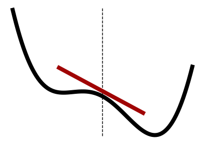

# Explanations *emphasis*

Explanations contain background information on important topics. They are not needed to
get started, but very helpful for advanced users and developers of estimagic.


.. raw:: html

    <div class="container" id="index-container">
        <div class="row">
            <div class="col-lg-6 col-md-6 col-sm-6 col-xs-12 d-flex">
                <a href="optimization/index.html" id="index-link">
                    <div class="card text-center intro-card shadow">
                        
                        <div class="card-body flex-fill">
                            <h5 class="card-title">Optimization</h5>
                            <p class="card-text">
                                Learn how to use constraints, parallelize function evaluations and configure every aspect of your optimization
                            </p>
                        </div>
                    </div>
                </a>
            </div>
            <div class="col-lg-6 col-md-6 col-sm-6 col-xs-12 d-flex">
                <a href="differentiation/index.html" id="index-link">
                    <div class="card text-center intro-card shadow">
                        
                        <div class="card-body flex-fill">
                            <h5 class="card-title">Differentiation</h5>
                            <p class="card-text">
                                Learn how to influence step sizes, parallelize function evaluations and use advanced options for numerical differentiation
                            </p>
                        </div>
                    </div>
                </a>
            </div>
            <div class="col-lg-6 col-md-6 col-sm-6 col-xs-12 d-flex">
                <a href="inference/index.html" id="index-link">
                    <div class="card text-center intro-card shadow">
                        
                        <div class="card-body flex-fill">
                            <h5 class="card-title">Estimation</h5>
                            <p class="card-text">
                                Learn how to calculate different types of standard errors an do sensitivity analysis
                            </p>
                        </div>
                    </div>
                 </a>
            </div>
        </div>
    </div>


```{toctree}
---
maxdepth: 1
---
   :hidden:

   optimization/index
   differentiation/index
   inference/index
```