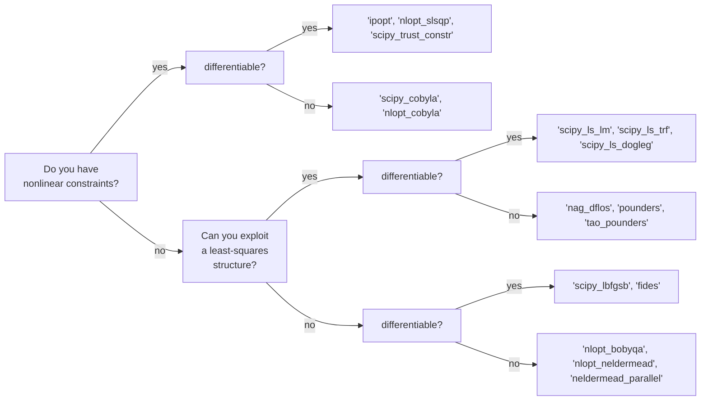

# Which optimizer to use

This is a short and a simplified guide on selecting an optimization algorithm based on the properties of your problem.

Knowledge of those properties can significantly narrow the set of algorithms best suited for your problem. 

### Choosing a local optimizer


Almost always, you will have more than one algorithm to try out choose the best by comparing them via the `criterion_plot` [insert link]. 

Remember, no amount of theory can replace experimentation!

```{eval-rst}
.. tabbed:: Differentiable Scalar Function
    As an example of unconstrained optimization problem with a scalar differentiable objective function, consider the minimization of the sphere function: 
    .. code-block:: python
        import numpy as np
        
        def sphere(params):
            return params@params
        
        def sphere_gradient(params):
            return params*2

        start_params = np.arange(5)

    For this problem, the algorithm choice lies between ``'scipy_lbfgs'`` and ``'fides'``. 