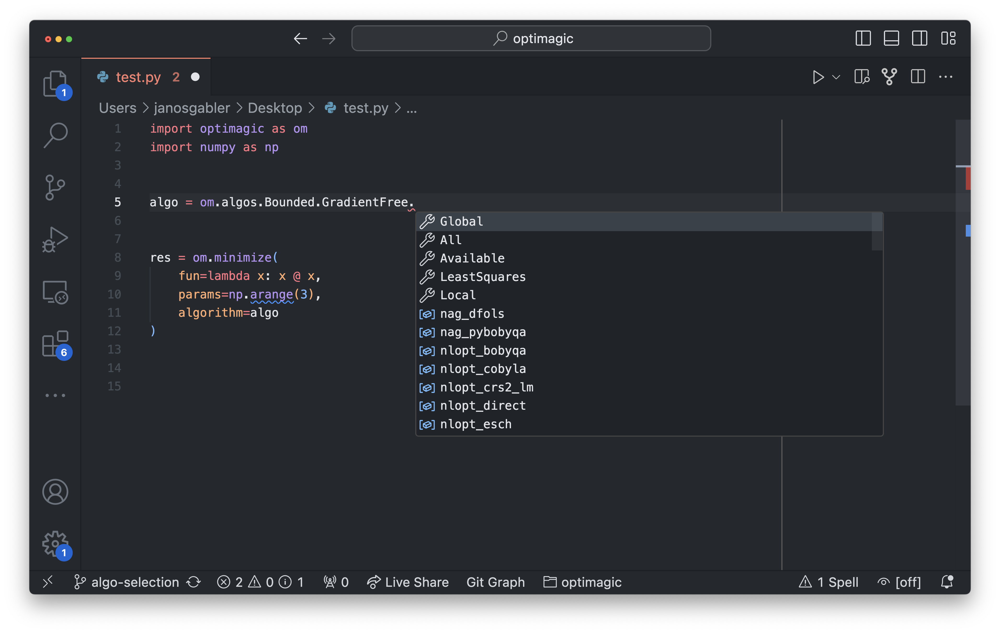
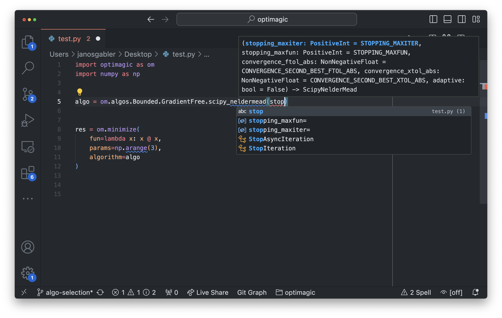

(specify-algorithm)=

# How to specify and configure algorithms

This how-to guide is about the mechanics of specifying and configuring optimizers in
optimagic. It is not about choosing the right algorithm for your problem. For a
discussion on choosing algorithms, see
[this how-to guide](how_to_algorithm_selection.ipynb)

There are two ways to specify and configure optimizers. The *optimagic way* and the
*scipy way*. Both use the `algorithm` argument of `minimize` and `maximize` to specify
an optimizer and both are super easy to use.

As the name suggests, the *scipy way* is more familiar for users of scipy.optimize. The
*optimagic way* has much better discoverability and autocomplete. Using the *optimagic
way*, you don't need to look things up in the documentation and rarely have to leave
your editor, notebook or IDE.

::::\{tab-set} :::\{tab-item} The optimagic way :sync: optimagic

## Selecting an algorithm

```python
import optimagic as om
import numpy as np


def fun(x):
    return x @ x


om.minimize(
    fun=fun,
    params=np.arange(3),
    algorithm=om.algos.scipy_neldermead,
)
```

The algorithm is selected by passing an algorithm class. This class is usually not
imported manually, but discovered using `om.algos`. After typing `om.algos.`, your
editor will show you all algorithms you can choose from.

## Configuring an algorithm

To configure an algorithm with advanced options, you can create an instance of the
class:

```python
algo = om.algos.scipy_neldermead(
    stopping_maxiter=100,
    adaptive=True,
)

om.minimize(
    fun=fun,
    params=np.arange(3),
    algorithm=algo,
)
```

Again, you can use your editor's autocomplete to discover all options that your chosen
algorithm supports. When the instance is created, the types and values of all options
are checked. Should you make a mistake, you will get an error before you run your
optimization.

## Advanced autocomplete in action

Assume you need a gradient-free optimizer that supports bounds on the parameters.
Moreover, you have a fixed computational budget, so you want to set stopping options.

If you type `om.algos.`, your editor will show you all available optimizers and a list
of categories you can use to filter the results. In our case, we select `GradientFree`
and `Bounded`, and we could do that in any order we want.



After selecting one of the displayed algorithms, in our case `scipy_neldermead`, the
editor shows all tuning parameters of that optimizer. If you start to type `stopping`,
you will see all stopping criteria that are available.



## Modifying an algorithm

Given an algorithm, you can easily create a **modified copy** by using the `with_option`
method.

```python
# using copy constructors to create variants
base_algo = om.algorithms.fides(stopping_maxiter=1000)
algorithms = [
    base_algo.with_option(trustregion_initial_radius=r) for r in [0.1, 0.2, 0.5]
]

for algo in algorithms:
    minimize(
        fun=fun,
        params=np.arange(3),
        algorithm=algo,
    )
```

::: :::\{tab-item} The scipy way :sync: scipy

## Selecting an algorithm

```python
import optimagic as om
import numpy as np


def fun(x):
    return x @ x


om.minimize(
    fun=fun,
    params=np.arange(3),
    algorithm="scipy_lbfgsb",
)
```

For a list of all supported algorithm names, see {ref}`list_of_algorithms`.

## Configuring an algorithm

To configure an algorithm, you can pass a dictionary to the `algo_options` argument.

```python
options = {
    "stopping_maxiter": 100,
    "adaptive": True,
}

om.minimize(
    fun=fun,
    params=np.arange(3),
    algorithm="scipy_neldermead",
    algo_options=options,
)
```

If `algo_options` contains options that are not supported by the optimizer, they will be
ignored and you get a warning.

To find out which options are supported by an optimizer, see {ref}`list_of_algorithms`.

::: ::::
