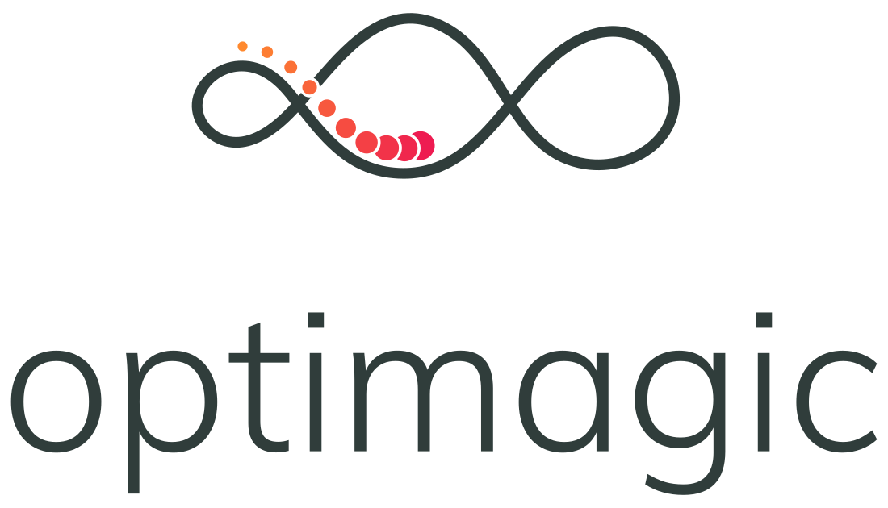
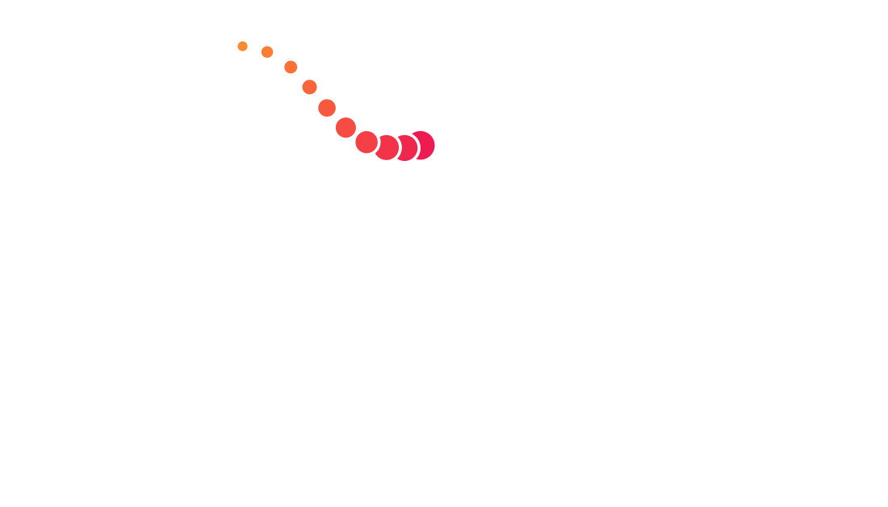

# 

<div style="padding-top: 50px;">
</div>

```{raw} html



```

<br>
<br>

*optimagic* is a Python package for numerical optimization. It is a unified interface to
optimizers from SciPy, NlOpt and many other Python packages.

*optimagic*'s `minimize` function works just like SciPy's, so you don't have to adjust
your code. You simply get more optimizers for free. On top you get powerful diagnostic
tools, parallel numerical derivatives and more. If you want to see what *optimagic* can
do, check out this [tutorial](tutorials/optimization_overview.ipynb)

*optimagic* was formerly called *estimagic*, because it also provides functionality to
perform statistical inference on estimated parameters. *estimagic* is now a subpackage
of *optimagic*, which is documented [here](estimagic).

`````{grid} 1 2 2 2
---
gutter: 3
---
````{grid-item-card}
:text-align: center
:img-top: _static/images/light-bulb.svg
:class-img-top: index-card-image
:shadow: md

```{button-link} tutorials/index.html
---
click-parent:
ref-type: ref
class: stretched-link index-card-link sd-text-primary
---
Tutorials
```

New users of optimagic should read this first.

````

````{grid-item-card}
:text-align: center
:img-top: _static/images/book.svg
:class-img-top: index-card-image
:shadow: md

```{button-link} how_to/index.html
---
click-parent:
ref-type: ref
class: stretched-link index-card-link sd-text-primary
---
How-to Guides
```

Detailed instructions for specific and advanced tasks.

````

````{grid-item-card}
:text-align: center
:img-top: _static/images/installation.svg
:class-img-top: index-card-image
:shadow: md

```{button-link} installation.html
---
click-parent:
ref-type: ref
class: stretched-link index-card-link sd-text-primary
---
Installation
```

Installation instructions for optimagic and optional dependencies.

````

````{grid-item-card}
:text-align: center
:img-top: _static/images/optimization.svg
:class-img-top: index-card-image
:shadow: md

```{button-link} algorithms.html
---
click-parent:
ref-type: ref
class: stretched-link index-card-link sd-text-primary
---
Optimization Algorithms
```

List of numerical optimizers and their optional parameters.

````


````{grid-item-card}
:text-align: center
:img-top: _static/images/books.svg
:class-img-top: index-card-image
:shadow: md

```{button-link} explanation/index.html
---
click-parent:
ref-type: ref
class: stretched-link index-card-link sd-text-primary
---
Explanations
```

Background information on key topics central to the package.

````

````{grid-item-card}
:text-align: center
:img-top: _static/images/coding.svg
:class-img-top: index-card-image
:shadow: md

```{button-link} reference/index.html
---
click-parent:
ref-type: ref
class: stretched-link index-card-link sd-text-primary
---
API Reference
```

Detailed description of the optimagic API.

````

````{grid-item-card}
:text-align: center
:columns: 12
:img-top: _static/images/video.svg
:class-img-top: index-card-image
:shadow: md

```{button-link} videos.html
---
click-parent:
ref-type: ref
class: stretched-link index-card-link sd-text-primary
---
Videos
```

Collection of tutorials, talks, and screencasts on optimagic.

````

`````

```{toctree}
---
hidden: true
maxdepth: 1
---
tutorials/index
how_to/index
explanation/index
reference/index
development/index
videos
algorithms
estimagic/index
installation
```

______________________________________________________________________

We thank all institutions that have funded or supported optimagic (formerly estimagic)

```{image} _static/images/aai-institute-logo.svg
---
width: 185px
---
```

```{image} _static/images/numfocus_logo.png
---
width: 200
---
```

```{image} _static/images/tra_logo.png
---
width: 240px
---
```

```{image} _static/images/hoover_logo.png
---
width: 192px
---
```

```{image} _static/images/transferlab-logo.svg
---
width: 420px
---
```

______________________________________________________________________

**Useful links for search:** {ref}`genindex` | {ref}`modindex` | {ref}`search`
