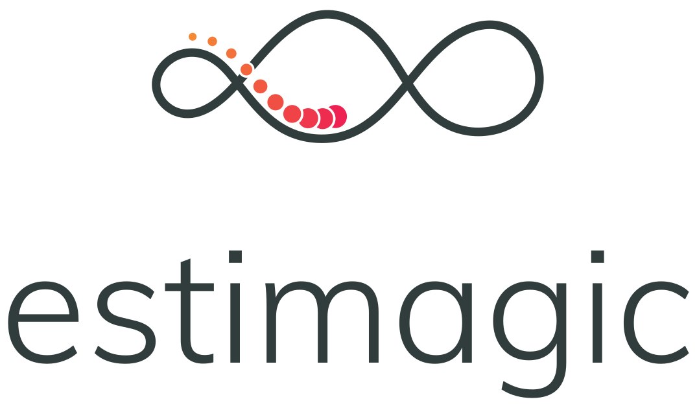
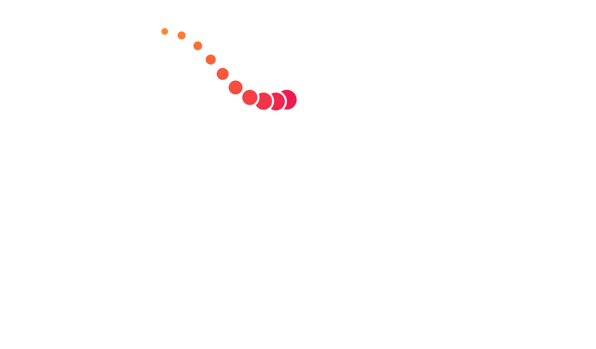
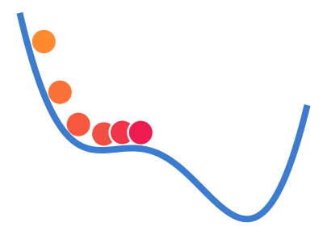
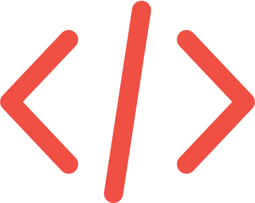

```{raw} html
<style>
    .logo.mainlogo img {
        background-color: transparent; /* Ensure SVG has no background */
        max-height: 100px; /* Adjust size as needed */
    }
</style>

<!-- Light mode logo -->
<div class="logo mainlogo only-light" style="text-align: center;">
    
</div>

<!-- Dark mode logo -->
<div class="logo mainlogo only-dark" style="text-align: center;">
    
</div>
```

<br>
<br>

estimagic is a Python package for nonlinear optimization with or without constraints. It
is particularly suited to solve difficult nonlinear estimation problems. On top, it
provides functionality to perform statistical inference on estimated parameters.

For a complete introduction to optimization in estimagic, check out the
{ref}`estimagic_scipy2022`

```{raw} html
<div class="container" id="index-container">
    <div class="row">
        <div class="col-lg-6 col-md-6 col-sm-6 col-xs-12 d-flex">
            <a href="getting_started/index.html" id="index-link">
                <div class="card text-center intro-card shadow">
                    
                    <div class="card-body flex-fill">
                        <h5 class="card-title">Getting Started</h5>
                        <p class="card-text">
                            New users of estimagic should read this first.
                        </p>
                    </div>
                </div>
            </a>
        </div>
        <div class="col-lg-6 col-md-6 col-sm-6 col-xs-12 d-flex">
            <a href="how_to_guides/index.html" id="index-link">
                <div class="card text-center intro-card shadow">
                    
                    <div class="card-body flex-fill">
                        <h5 class="card-title">How-to Guides</h5>
                        <p class="card-text">
                            Detailed instructions for specific and advanced tasks.
                        </p>
                    </div>
                </div>
            </a>
        </div>
        <div class="col-lg-6 col-md-6 col-sm-6 col-xs-12 d-flex">
            <a href="getting_started/installation.html" id="index-link">
                <div class="card text-center intro-card shadow">
                    
                    <div class="card-body flex-fill">
                        <h5 class="card-title">Installation</h5>
                        <p class="card-text">
                            Installation instructions for estimagic
                            and optional dependencies.
                        </p>
                    </div>
                </div>
            </a>
        </div>
        <div class="col-lg-6 col-md-6 col-sm-6 col-xs-12 d-flex">
            <a href="algorithms.html" id="index-link">
                <div class="card text-center intro-card shadow">
                    
                    <div class="card-body flex-fill">
                        <h5 class="card-title">Optimization Algorithms</h5>
                        <p class="card-text">
                            List of numerical optimizers and their optional parameters.
                        </p>
                    </div>
                </div>
            </a>
        </div>
        <div class="col-lg-6 col-md-6 col-sm-6 col-xs-12 d-flex">
            <a href="explanations/index.html" id="index-link">
                <div class="card text-center intro-card shadow">
                    
                    <div class="card-body flex-fill">
                        <h5 class="card-title">Explanations</h5>
                        <p class="card-text">
                            Background information to key topics
                            underlying the package.
                        </p>
                    </div>
                </div>
            </a>
        </div>
        <div class="col-lg-6 col-md-6 col-sm-6 col-xs-12 d-flex">
            <a href="reference_guides/index.html" id="index-link">
                <div class="card text-center intro-card shadow">
                    
                    <div class="card-body flex-fill">
                        <h5 class="card-title">API Reference</h5>
                        <p class="card-text">
                            Detailed description of the estimagic API.
                        </p>
                    </div>
                </div>
            </a>
        </div>
    </div>
</div>
```

```{toctree}
---
hidden: true
maxdepth: 1
---
getting_started/index
how_to_guides/index
explanations/index
reference_guides/index
```

## Highlights

### Optimization

- estimagic wraps algorithms from *scipy.optimize*, *nlopt*, *pygmo* and more. See
  {ref}`list_of_algorithms`
- estimagic implements constraints efficiently via reparametrization, so you can solve
  constrained problems with any optimzer that supports bounds. See {ref}`constraints`
- The parameters of an optimization problem can be arbitrary pytrees. See {ref}`params`.
- The complete history of parameters and function evaluations can be saved in a database
  for maximum reproducibility. See [How to use logging]
- Painless and efficient multistart optimization. See [How to do multistart]
- The progress of the optimization is displayed in real time via an interactive
  dashboard. See {ref}`dashboard`.

> ```{image} _static/images/dashboard.gif
> ---
> align: center
> scale: 80 %
> ---
> ```

### Estimation and Inference

- You can estimate a model using method of simulated moments (MSM), calculate standard
  errors and do sensitivity analysis with just one function call. See [MSM Tutorial]
- Asymptotic standard errors for maximum likelihood estimation.
- estimagic also provides bootstrap confidence intervals and standard errors. Of course
  the bootstrap procedures are parallelized.

### Numerical differentiation

- estimagic can calculate precise numerical derivatives using
  [Richardson extrapolations](https://en.wikipedia.org/wiki/Richardson_extrapolation).
- Function evaluations needed for numerical derivatives can be done in parallel with
  pre-implemented or user provided batch evaluators.

**Useful links for search:** {ref}`genindex` | {ref}`modindex` | {ref}`search`

```{toctree}
---
hidden: true
maxdepth: 1
---
development/index
algorithms
```

[how to do multistart]: how_to_guides/optimization/how_to_do_multistart_optimizations
[how to use logging]: how_to_guides/optimization/how_to_use_logging
[msm tutorial]: getting_started/estimation/first_msm_estimation_with_estimagic
